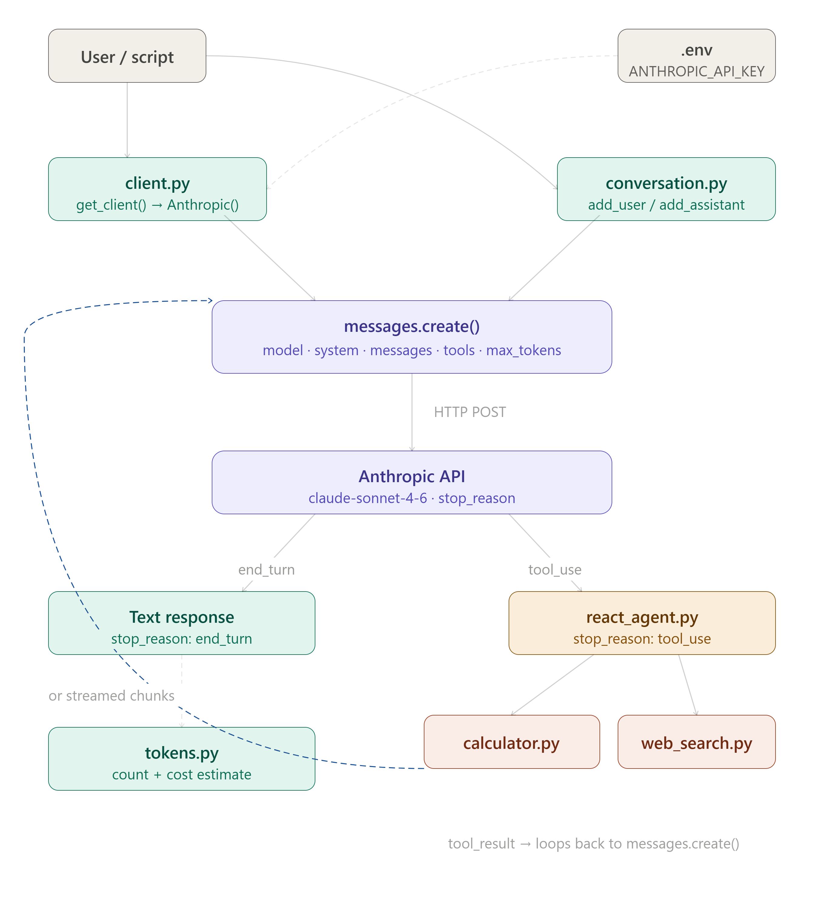

# claude-api-starter 🤖
 
A clean, opinionated Python starter kit for building with the Anthropic Claude API — covering basic completions, tool use, multi-turn conversations, agents, and streaming.

> Built by [Lazaro Gomez Vitolo](https://lazaro549.github.io/Portafolio/) after completing the *Building with the Claude API* course on Anthropic Academy.

---

## Features

- ✅ Basic messages & system prompts
- ✅ Multi-turn conversation management
- ✅ Streaming responses
- ✅ Tool use (function calling)
- ✅ Simple ReAct-style agent loop
- ✅ Token counting & cost estimation utilities
- ✅ Environment-based config (no hardcoded keys)
- ✅ Example scripts ready to run

---

## Project Structure

```
claude-api-starter/
├── src/
│   ├── agents/
│   │   └── react_agent.py       # ReAct agent loop with tool use
│   ├── tools/
│   │   ├── calculator.py        # Math tool example
│   │   └── web_search.py        # Search tool stub
│   └── utils/
│       ├── client.py            # Anthropic client factory
│       ├── conversation.py      # Conversation history manager
│       └── tokens.py            # Token counting helpers
├── examples/
│   ├── 01_basic_message.py
│   ├── 02_streaming.py
│   ├── 03_multi_turn.py
│   ├── 04_tool_use.py
│   └── 05_agent.py
├── tests/
│   ├── test_conversation.py
│   └── test_tools.py
├── docs/
│   └── CONCEPTS.md
├── .env.example
├── requirements.txt
└── README.md
```

---

## Quickstart

### 1. Clone & install

```bash
git clone https://github.com/Lazaro549/claude-api-starter.git
cd claude-api-starter
python -m venv .venv && source .venv/bin/activate   # Windows: .venv\Scripts\activate
pip install -r requirements.txt
```

### 2. Set your API key

```bash
cp .env.example .env
# Edit .env and add your ANTHROPIC_API_KEY
```

### 3. Run an example

```bash
python examples/01_basic_message.py
python examples/05_agent.py
```

---

## Usage

### Basic message

```python
from src.utils.client import get_client

client = get_client()

response = client.messages.create(
    model="claude-sonnet-4-6",
    max_tokens=1024,
    messages=[{"role": "user", "content": "Explain recursion in one paragraph."}]
)

print(response.content[0].text)
```

### Multi-turn with history manager

```python
from src.utils.client import get_client
from src.utils.conversation import ConversationManager

client = get_client()
conv = ConversationManager(system="You are a helpful coding assistant.")

conv.add_user("What is a closure in Python?")
response = client.messages.create(
    model="claude-sonnet-4-6",
    max_tokens=1024,
    system=conv.system,
    messages=conv.messages
)
conv.add_assistant(response.content[0].text)

conv.add_user("Give me a short example.")
# ... continue the conversation
```

### Tool use

```python
from src.tools.calculator import CALCULATOR_TOOL, run_calculator
# See examples/04_tool_use.py for the full agentic loop
```

---

## Requirements

```
anthropic>=0.25.0
python-dotenv>=1.0.0
```

---

## Concepts Covered

See [`docs/CONCEPTS.md`](docs/CONCEPTS.md) for notes on:

- Messages API structure
- System prompts
- Stop reasons & multi-stop handling
- Tool use lifecycle (`tool_use` → `tool_result`)
- Streaming with `stream()` context manager
- Token limits and cost management

---

## 💸 Donations

If you find this project useful and want to support it:

| Currency | Alias |
|---|---|
| 🇦🇷 ARS (Argentina) | `lazaro.503.alaba.mp` |
| 🌎 USD (Argentina — local transfers only) | `ahogada.duras.foca` |

---

## License

MIT — use freely, attribution appreciated.
